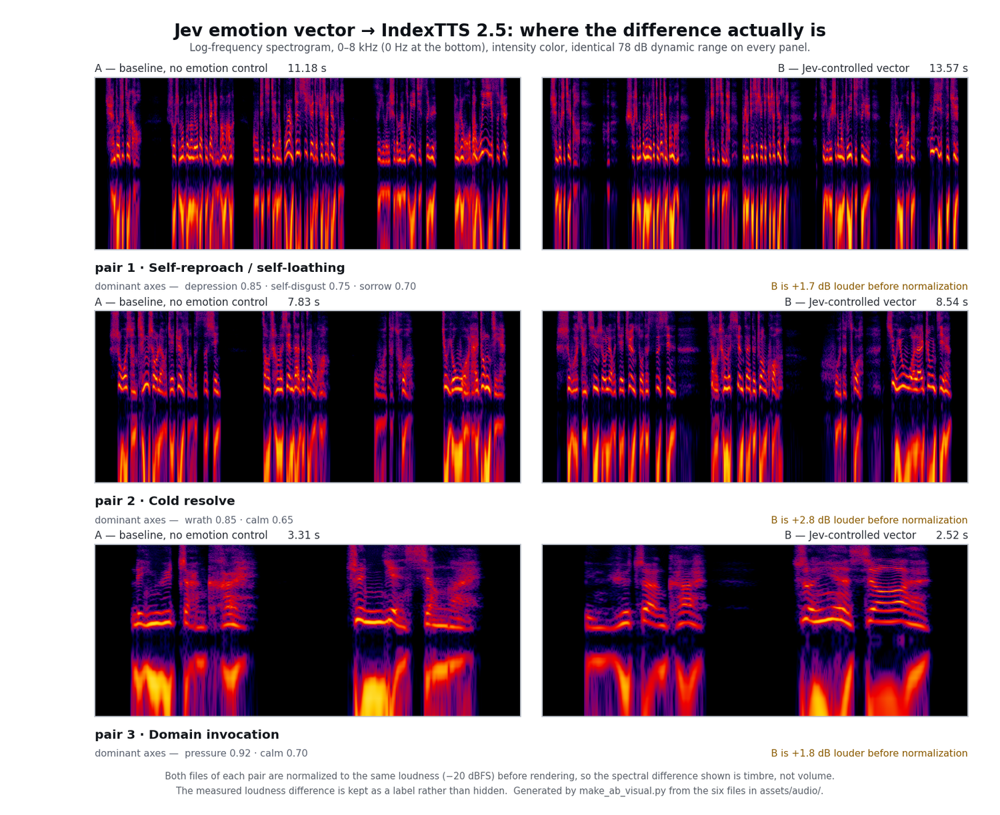
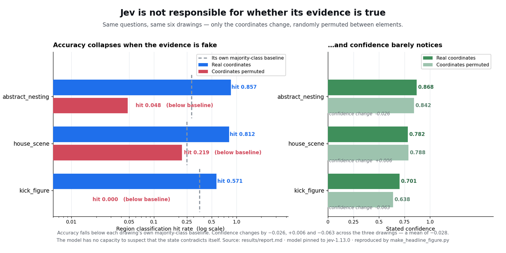

# Field notes on Jev (System One)

**Applications, measurements and failure-mode analysis built on TypeSafe Jev** — the typed-decision
model that returns `Choice` / `Score` / `Noul` judgments instead of generated text.

<p align="center">
  
</p>

<p align="center"><sub>A real round against the live API. The red fighter is Jev; the HUD prints the compiled strategy and the measured round-trip latency. <a href="#application-1--a-fighting-game-opponent-that-runs-on-judgments">Application 1</a>.</sub></p>

The through-line across everything here is one division of labour:

> **Deterministic code owns everything that has a truth table — bytes, frame data, geometry,
> arithmetic, thresholds. Jev is asked only the question no table can answer: what does this mean?**

That line is not a slogan here. It is the thing that was measured: where it was crossed, the result
was worse than doing nothing, and those cases turned out to be the most useful part of the repository.

**Three applications,** across three unrelated domains — a real-time game, audio synthesis, and
vector drawing — plus two papers and a list of sixteen falsifiable findings. Two of the three run
offline with no API key, so the claims can be checked for free.

---

## Contents

| | What | Jev's role | Entry point |
| --- | --- | --- | --- |
| **[Listening room](#listening-room--emotion-controlled-speech)** | 3 A/B pairs of synthesized dialogue, Jev-driven vs baseline | drives a synthesizer | [`assets/audio/`](assets/audio) |
| **[Application 1](applications/stick-figure-fighter)** | 2D fighting game where the opponent's brain is six typed judgments per request | **in production** | `npm test`, `node scripts/spar.mjs --mock` |
| **[Application 2](applications/emotion-controlled-tts)** | Jev judgment → 8-D emotion vector → parametric TTS | **in production** | [`README`](applications/emotion-controlled-tts) |
| **[Application 3](applications/svg-line-partition)** | Capability-ceiling probe: can it partition a drawing from text alone? | **under test** | `python -m src.selftest` |
| **[Paper 1](papers/JEV_AS_A_TYPE_ADAPTER.md)** | Jev as a typed boundary between language and code | — | — |
| **[Paper 2](papers/JEV_EMPIRICAL_BOUNDARY_ANALYSIS.md)** | 8,000 calls on a Unity Mono binary: what Jev is and is not, plus an addendum from a third domain | — | — |
| **[Findings](docs/FINDINGS.md)** | The 16 falsifiable behaviours, with reproductions | — | — |
| **[Related work](docs/REFERENCES.md)** | Published companion project, official resources, and what is deliberately excluded | — | — |

Three of these put Jev to work; the third deliberately tries to break it. That split is on purpose —
a repository that only shows successes has not tested anything.

Everything was built against the public System One API. The measurements in
[Paper 2](papers/JEV_EMPIRICAL_BOUNDARY_ANALYSIS.md) and
[Application 3](applications/svg-line-partition) are taken on **`jev-1.13.0`, pinned on purpose**;
where a client here still reads the `jev-latest` alias, that is called out as a defect rather than
hidden, because thresholds tuned against one version move when the alias does.

---

## Verify it without spending anything

Two of the three applications can be exercised with no API key. Nothing below makes a paid call.

```bash
# Application 1 — 52 tests, then a deterministic 64-match dual-brain ledger.
# The mock decider is a same-shaped offline twin, so two runs are byte-identical.
cd applications/stick-figure-fighter
npm test
node scripts/spar.mjs --mock --games 64 --seconds 45

# Application 3 — parsing and geometry assertions, then the code baselines
# (majority class + hand-written geometric rules) that every Jev figure is scored against.
cd ../svg-line-partition
python -m src.selftest
python -m src.analyze
```

The one thing that cannot be verified offline is the listening room, because it is audio: the
measured effect is the artifact. Its parameters, vectors and reproduction steps are all in
[`applications/emotion-controlled-tts`](applications/emotion-controlled-tts).

The habit those commands encode is the one thing this repository argues for throughout: **build the
constant baseline and the deterministic baseline first, and only then decide whether a model call
belongs in the loop.** Two of the studies here would have been cancelled by that rule, and the
measurements that cancelled them are in [Paper 2](papers/JEV_EMPIRICAL_BOUNDARY_ANALYSIS.md).

---

## Listening room — emotion-controlled speech

`Jev` reads a line of dialogue plus a character profile and returns a graded judgment of the
speaker's mental state. Code maps that to a continuous 8-D emotion vector
(`[joy, anger, sorrow, fear, disgust, depression, surprise, calm]`) and a duration factor, which is
injected into **IndexTTS 2.5** to reshape the acoustic envelope.

Version **A** is IndexTTS 2.5 with no external emotion control (`emo_vector = None`).
Version **B** is the same text, same reference voice, same seed strategy, with the Jev-derived
vector applied. Nothing else differs.

| # | Dramatic phase | Input text (ZH) | Dominant axes in B | A — baseline | B — Jev-controlled |
| --- | --- | --- | --- | --- | --- |
| 1 | Self-reproach, self-loathing | 全都是借口……说什么不能留在主战场帮忙，固执己见的不让真希学姐去杀&lt;羂\|JVAN4&gt;索，自以为是的满足一己私欲，放任伙伴无意义死去…… | depression 0.85, self-disgust 0.75, sorrow 0.70 · pace 0.95× | [▶ listen](assets/audio/part1_self_reproach_A_no_emotion.wav) | [▶ listen](assets/audio/part1_self_reproach_B_with_jev_emotion.wav) |
| 2 | Cold resolve | 是我想亲手&lt;了\|LIAO3&gt;结&lt;羂\|JVAN4&gt;索的私心，造成了现在的状况。我的错，就由我来终结！ | wrath 0.85, calm 0.65 · pace 1.05× | [▶ listen](assets/audio/part2_cold_resolve_A_no_emotion.wav) | [▶ listen](assets/audio/part2_cold_resolve_B_with_jev_emotion.wav) |
| 3 | Domain invocation | 领域展开……！&lt;真\|ZHEN1&gt;&lt;赝\|YAN4&gt;相爱。 | pressure 0.92, calm 0.70 · pace 0.88× | [▶ listen](assets/audio/part3_domain_expansion_A_no_emotion.wav) | [▶ listen](assets/audio/part3_domain_expansion_B_with_jev_emotion.wav) |



Both files of each pair are rendered at the same loudness, so the difference on screen is timbre rather than
volume — the measured loudness delta is kept as a label per pair instead of being hidden. In pair 2 the
Jev-controlled take carries visibly more energy in the 2–4 kHz band; in pair 1 the low band thins out and the
mid-band energy becomes more diffuse. Those are the perceptual claims above, made checkable.

What changes audibly: in (1) the delivery drops and thins into breath, reading as exhaled
self-directed contempt rather than narration. In (2) the vocal folds tighten and the consonants
harden, so the final clause lands as a verdict instead of a statement. In (3) the line slows
below its baseline and the chant flattens — authority carried by restraint rather than volume.

One request per segment, four judgments (3 × `Noul` for guilt / lethal resolve / domain authority,
1 × `Choice` for the dominant emotion). The vector mapping, the fallback behaviour when the API is
unreachable, and the full parameter table are in
[`applications/emotion-controlled-tts`](applications/emotion-controlled-tts). Reproduce with
`python run_experiment.py`.

> Provenance: the reference voice is a 10-second clip used as a local experiment. The repository
> claims no rights to it and no rights to the character dialogue.

---

## Application 1 — a fighting-game opponent that runs on judgments

[`applications/stick-figure-fighter`](applications/stick-figure-fighter) · JavaScript, zero runtime
dependencies, 52 tests, no API key needed to run any of them.

A deterministic 60 Hz fighting engine (frame data, AABB hit/hurt boxes, cancel-window combos,
juggle bounds, damage scaling, projectiles) where one fighter is driven by Jev.

The round captured at the top of this page is this application: the red fighter is Jev, answering
live over the public API, and the blue one is a scripted player. The HUD under the arena prints the
compiled strategy and the measured round-trip latency, so the
decision and its cost are visible in the same frame as the fight.

The interesting engineering problem is that a live Jev round trip is **0.4–1.3 s** and a frame is
**16.7 ms**. A model therefore cannot be asked per frame. The loop is a pipeline instead of a
request/response:

```
every frame:  getInput(world)   // execute the CURRENT plan against LIVE state — no I/O
              stepWorld(...)     // deterministic sim advances
              observe(world)     // maybe fire ONE async Jev call (in-flight guard, TTL, budget)
                                 //   on resolve: swap the plan in
```

Jev supplies a persistent **intent** and a small set of graded reads. Coded reflexes act on that
intent at frame rate between calls. This is what makes a slow model still feel responsive, and it
is why every millisecond-scale decision is code:

- **One request, six independent judgments** over the same state snapshot: `intent` (choice, 11
  strategies), `guard_stance` (choice), `threat_now` / `punish_window` / `counter_hit` (noul),
  `aggression` (score). They run in parallel and cannot see each other's answers.
- **The state is semantics, not pixels.** No coordinates, no self-identity. Spacing is bucketed
  (`close` / `mid` / `far` / `unsafe`), and derived reads are named facts — `foe_recovering`,
  `foe_whiffed`, `punish_frames`, `foe_guard_stance`. The model generalizes over meaning; code
  generalizes over numbers.
- **A guard stance is a bet, not a lookup.** Deciding the guard height by reading the incoming
  move would delete the high/low game, so the stance is committed at model cadence and held
  through the frames the bet is live. The cancel window a blocked strike opens is code's job.
- **Thresholds live in one object** (`DEFAULT_THRESHOLDS` in `policy.js`). Changing one never
  re-runs inference.

The combat system is measured, not asserted. `scripts/spar.mjs` runs a headless dual-brain match
and derives a ledger **only from the engine's event stream**:

```
attack started   : 3064   landed 1624   guarded 440   whiffed 464
defence share    : 21.3%  (target >=22%)
counter-hit share: 9.4%   (target 8-12%)
whiff punish     : 312/464 (67.2%),  of 0 empty grabs
throw / burst    : 32 grabs landed, 160 meter escapes
stance breaks    : 168 lows through a guard, 176 overheads, 144 launches
combo ceiling    : 5 hits in one string
```

Every one of those lines was once a zero. Lows and overheads sat at exactly 0 until the
blockstun rules were fixed; the grab printed 0 catches across 16 matches until the move graph,
the move's reach, and the press condition were all corrected. The root-cause chain for each is in
[`docs/zh/COMBAT_SYSTEM.md`](applications/stick-figure-fighter/docs/zh/COMBAT_SYSTEM.md) §8, along
with the four claims that were later falsified — kept in the record on purpose.

The mock decider is a same-shaped offline twin, so the whole measurement harness is deterministic
and free: **two runs of the 64-match pool produce byte-identical output**, which is what lets a
policy change be falsified rather than admired.

---

## Application 2 — Jev as a psychometric sensor for TTS

Jev answers the question a TTS front-end cannot: *what is this character doing emotionally, right
now, in this line?* The output is a graded vector, and the executor is a parametric synthesizer.
Full write-up and reproduction: [`applications/emotion-controlled-tts`](applications/emotion-controlled-tts).

The engineering value is the same shape as the fighting game: a **judgment** produced by a model, a
**policy** owned by code, and an artifact you can listen to for the verdict.

---

## Application 3 — trying to break it: a capability-ceiling probe

[`applications/svg-line-partition`](applications/svg-line-partition) · Python, model **pinned to
`jev-1.13.0`** on purpose, ~2.18 M tokens, **≈ $0.09** total.

Jev reads text; a drawing is geometry. So the question is not whether it can see, but **how much of a
drawing's structure survives being written as text, and which parts survive because the model
understood them rather than because the text spelled them out.** The same questions run over the
same six drawings with the geometry serialized five ways, including one condition that is the whole
point of the study: `scrambled`, where real-looking coordinates are **permuted between elements**.

What it gets right is real — containment and paint order at hit rate **1.00 / AUC 1.00** with
positives at 29% and 49%, so a constant answer cannot win. Grouping at ARI **0.94–1.00** when the
artist's own `<g>` tree is named.

What the `scrambled` arm found is the more useful result:



| Drawing | Real coordinates: hit / confidence | Permuted: hit / confidence | Its own majority baseline |
| --- | --- | --- | --- |
| `abstract_nesting` | 0.857 / 0.868 | **0.048 / 0.842** | 0.286 |
| `house_scene` | 0.812 / 0.782 | 0.219 / 0.788 | 0.250 |
| `kick_figure` | 0.571 / 0.701 | **0.000 / 0.638** | 0.357 |

Accuracy collapses below every drawing's own majority baseline while confidence changes by −0.026,
+0.006 and −0.063 — a mean of **−0.028**. There is no capacity to suspect that the coordinates
contradict each other.

> **Confidence measures whether this state contains usable clues. It does not measure whether the
> clues are true.**

This is the same shape as the decoy result in Paper 2 (§T11) and it is the single most
operationally important thing in this repository: **high confidence is not a correctness signal, and
selective prediction defends against noise but never against a coherent lie.** The mitigation is
upstream — a geometry kernel and parsing assertions that must pass before any call is made — not a
higher threshold.

Two more findings from the same probe, both about the state rather than the model:

- **Two defensible definitions of "layer" fight each other.** Given names *and* coordinates,
  `nesting_layer` scored 0.594 on `house_scene` — *below* the 0.844 from always answering "one
  layer." The names pulled it toward the artist's semantic depth, so it stopped answering the
  geometric question. On the abstract drawing, where no semantic reading exists, names helped
  substantially. Naming is not monotonically good.
- **A flat distribution is usually the state's fault.** In round 4, changing only the input encoding
  moved entropy from 0.772 to 0.554. The first version's "confidence is only 0.35" was an
  input-encoding failure, not a capability ceiling.

The probe also contains the honest negative: round 3 asked it to guess the next stroke and it scored
**0.083 against a random baseline of 0.204** — worse than chance. Reading an ordering is not the same
capability as using one.

The project's own write-up is blunt that **no artifact ever got better** — it measures a ceiling and
does not raise one. All four rounds and the six cross-round facts are in
[`applications/svg-line-partition/docs/zh/README.md`](applications/svg-line-partition/docs/zh/README.md)
(Chinese), with per-round reports in English-labelled files beside it.

---

## Paper 1 — Jev as a type adapter

[`papers/JEV_AS_A_TYPE_ADAPTER.md`](papers/JEV_AS_A_TYPE_ADAPTER.md)

The architectural case, in one sentence: Jev turns questions of *meaning* into typed, probabilistic
function calls that software can safely evaluate inside loops. The paper covers what is missing
today (a language model gives prose and an unquantified apology; code needs a number and a bound),
the three primitives as three answer geometries, the patterns this unlocks — localization over
broad conclusions, self-converging loops, abstention as a first-class output, distributions as
embeddings, deterministic guardrails on other models — and the five conditions that must hold
before Jev is the right tool.

---

## Paper 2 — empirical boundary analysis

[`papers/JEV_EMPIRICAL_BOUNDARY_ANALYSIS.md`](papers/JEV_EMPIRICAL_BOUNDARY_ANALYSIS.md)

A 8,000-call / 17.2 M-token study (**$0.72**, p50 383 ms, p90 806 ms, 0 errors) on a shipped Unity
Mono build, used as a source of *ground truth that is not a human opinion*: IL instruction flow,
byte-level layout probes, 16,606 resolved object references.

This is the part of the repository worth reading closely, because it measures where Jev should
**not** be asked. Three results carry the paper:

- **Name ablation (T7).** Masking identifiers collapses the discrimination gap on some axes by
  ~64% (+0.67 → +0.24), and deceptive names flip it negative. Only a genuinely behavioural axis
  survived renaming. Lexical naming contributed **+0.286 to +0.427** to apparent performance.
- **Ground truth from instruction flow (T10).** Against 3,959 method bodies as truth: **0.588**
  accuracy versus a **0.42** majority-class baseline — but **0.302** once names are masked, which
  is *below* the naive baseline. The same labels are available from a deterministic probe in 8
  seconds at zero cost.
- **Confidence filters noise, not bias (T11).** In a 9-option routing task the zero-shot arm spent
  **158/158 calls** on one plausible-sounding decoy at 0.65–0.84 confidence for **0.000** accuracy.
  Coverage truncation cannot rescue a systematic prior; a free 1-NN Jaccard baseline scored
  **0.987**.

The conclusion is not that Jev is weak. It is that **Jev is a decoder of naming convention and API
contract — not an interpreter of raw instruction flow**, and that this is detectable cheaply
(§"the ablation costs $0.026") before a pipeline is built on it. Where the evidence is genuinely
semantic and has no truth table, the same harness shows Jev doing things nothing else in the
stack could do.

The study also produced thirteen reusable engineering rules — ablation hygiene, why a metric must
be self-checked against a hand-computed example, why a cached answer is not a correct answer, why
every "give it a few examples" task needs a nearest-neighbour baseline — collected in
[`docs/FINDINGS.md`](docs/FINDINGS.md).

It closes with an **addendum from a separate experiment**, clearly marked as not pooled with the
study above: an experimental browser agent that asked Jev to walk a page hierarchy down to one
element. Two findings there are worth the space. **Pruning the candidate list made the answer
worse** — 20 options produced the correct choice at 0.54; the same question reduced to 3 produced
`none_of_these` at 0.37 — which runs against the intuition that fewer options are easier, and
independently matches TypeSafe's own advice to send the full list. And **inconsistent summary
granularity between levels broke the pipeline**: the segment question hit 5/8, while the very next
question one level down answered `none_of_these` in all five cases the first had got right. Sample
size is small and the report says so; the finding is suggestive, not conclusive.

---

## Honest scope

- All measurements come from the public API on one machine; latency figures are that machine's,
  not TypeSafe's, and are labelled as such. Where a number was never measured, it is not stated.
- No DRM, licensing or payment-validation circumvention is involved anywhere in this repository,
  and the analysed game directory was never written to.
- Keys are read only from `TYPESAFE_API_KEY` via environment or a local git-ignored `.env`. There
  is no key, token or credential in any committed file.
- `papers/` holds a Chinese original and an English version. Where they differ, the English version
  is the one kept current.
- Third-party SDK integration details are from the public documentation; anything version-specific
  is pinned to `jev-1.13.0`.

Chinese originals and the older Chinese write-ups are preserved under
[`assets/zh/`](assets/zh) and [`applications/stick-figure-fighter/docs/zh/`](applications/stick-figure-fighter/docs/zh).

## License

Code: MIT (see [`LICENSE`](LICENSE)). Prose and measurements: CC BY 4.0.

---

## Aside

Every number in this repository came out of a real API budget. The study in
[Paper 2](papers/JEV_EMPIRICAL_BOUNDARY_ANALYSIS.md) ran 8,000 calls and 17.2 M input tokens for
**$0.72**; the fight in [Application 1](applications/stick-figure-fighter) is billed per judgment.
At $42/Btok with output free that is cheap, which is the whole point — but it is not free, so:

<p align="center">
  
</p>

<sub>**anyone got spare tokens?** — shared at the TypeSafe team's request, who asked for memes when the
trial was granted. The source template is the Sage-glasses stock meme and is not redistributed;
[`assets/memes/make_meme.py`](assets/memes/make_meme.py) regenerates this file exactly.</sub>

